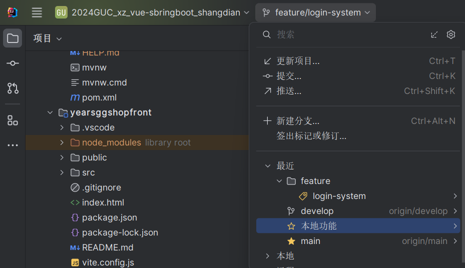

# 2024GUC_xz_vue-springboot_shangdian 团队开发指南

## 1. 项目分支结构
这是一个小组开发的远程仓库，我们会使用两个基础分支，即项目完成开发分支、测试分支，最后是每个人的本地分支

- **main 分支**：这是主分支，保持项目的稳定版本，不得直接在此分支上进行开发。只有经过严格测试和代码审查的功能才会合并到此分支。
- **dev 分支**：这是开发分支，用于集成所有开发中的新功能，所有团队成员的工作都会先推送到此分支进行集成测试。
- **本地分支**：每个团队成员应从 dev 分支创建自己的本地开发分支，用于开发自己负责的功能，开发完成后推送到远程 dev 分支。

## 2. 开发前准备

每次开始开发之前，团队成员必须先执行以下操作来确保自己的工作基于最新的代码：

~~~bash
git checkout develop  # 切换到 dev 分支
git pull origin develop  # 拉取远程 dev 分支的最新代码
~~~

这两个命令确保你能够获取到团队其他成员的最新工作进展，避免开发过程中出现冲突。

## 3. 创建本地功能分支

在拉取了最新的 dev 分支代码之后，接下来，你可以创建一个新的本地功能分支来进行开发。请遵循以下命令来创建并切换到新分支：

~~~bash
git checkout -b feature/功能名称  # 例如：feature/login-system
~~~

`feature/功能名称`：这里的功能名称应描述你正在开发的功能。例如：`feature/login-system`、`feature/user-profile` 等。

## 4. 开发过程中

在开发过程中，确保经常提交本地代码并推送到远程仓库。这样不仅能保存进度，还能避免丢失工作。

提交代码时，请注意编写清晰、有意义的提交信息，帮助团队成员理解更改内容。  
提交和推送操作示例：

~~~bash
git add .  # 添加所有更改的文件
git commit -m "完成了登录模块的开发"  # 提交更改，说明提交内容
git push origin feature/功能名称  # 将本地功能分支推送到远程仓库
~~~
注意创建分支后要切换到对应的分支上！！！

首先，你可以查看项目中当前所有的分支：

~~~bash
git branch  # 查看本地分支
git branch -r  # 查看远程分支
~~~
如果你已经知道要切换到的分支名称，可以使用以下命令：
使用 git checkout 命令：

~~~bash
git checkout 分支名称  # 切换到已有的分支
~~~
或者使用 git switch 命令（适用于 Git 2.23 及以上版本）：
~~~bash
git switch 分支名称  # 切换到已有的分支
~~~
现在你可以切换到你要的分支上面了，例如切换到你创建的功能分支上面，去完成功能的开发测试

(比如现在的我面对空无一物的模版，我要去完成登录和首页的设计，因此我建立一个feature/login-system分支作为本地开发分支，现在我要切换到它，完成它的功能后合并到develop分支上面)

或者通过idea智能切换分支，如果你没有idea或者不使用，那我只能说打命令行吧，毕竟就好比你有车一样，非要走路。
## 5. 合并到 dev 分支

当你完成了一个功能的开发，并且已经将其推送到远程仓库后，你需要将本地的功能分支合并到远程 dev 分支。为了保证合并前没有冲突，建议先同步一下远程 dev 分支的最新代码，再进行合并：

~~~bash
git checkout develop  # 切换到 dev 分支
git pull origin develop  # 拉取最新的 dev 分支代码，避免冲突
git checkout feature/功能名称  # 切换回自己的功能分支
git merge develop  # 将 dev 分支的最新代码合并到自己的功能分支
~~~

如果合并过程中出现了冲突，需要手动解决冲突，然后再次提交并推送代码。  
最后，通过 Pull Request (PR) 将功能分支合并回 dev 分支，并请求团队成员进行代码审查。

现在想必你已经切换到对应的分支上面了，现在你可以开始开发了。

假设你已经开发完了，现在你要把你开发的内容放入暂存区，然后执行以下命令：
~~~nash
git add .
~~~

## 6. 测试与集成

一旦所有功能分支合并到 dev 分支后，团队将进行集成测试。任何在 dev 分支上的问题都应及时修复，确保 dev 分支的代码始终保持可用状态。

定期执行代码的自动化测试，确保新增的功能没有破坏现有的系统。  
如果发现重大问题，使用 `git revert` 或者 `git reset` 来回滚错误的提交。

## 7. 发布准备

当 dev 分支上的功能开发完成，并且通过了所有测试后，团队会将 dev 分支的代码合并到 main 分支，准备发布。

这时，团队可以通过以下命令将 dev 分支合并到 main：

~~~bash
git checkout main  # 切换到 main 分支
git pull origin main  # 确保 main 分支是最新的
git merge develop  # 将 dev 分支的最新代码合并到 main
git push origin main  # 将合并后的代码推送到远程 main 分支
~~~

## 8. 日常维护

- **定期同步 dev 分支**：为了避免冲突，开发人员应当定期将远程 dev 分支的最新更新拉取到自己的本地分支。
- **合并策略**：避免直接推送到 main 分支，所有更改必须通过 dev 分支合并到 main。

### 小贴士：
- 确保每个开发人员都清楚分支的命名规则和操作流程。
- 使用清晰的提交信息，记录功能开发的进度，方便其他成员理解每次提交的变更。
- 合并时，确保代码经过团队的审查和测试，保证主分支的稳定性。

通过这种方式，你的团队可以确保开发流程顺畅，减少分支冲突，并保持代码的可维护性。如果有任何问题或不明白的地方，请随时向团队的其他成员寻求帮助。
